# Project Axis — Phase 2: Security Monitoring Tools

This repository is part of **Project Axis**, documenting my cybersecurity journey.  
Phase 2 focuses on building security monitoring skills, including file cleanup, process monitoring, port scanning, and network activity logging.

All scripts include safety checks and anonymization for privacy, and are fully documented with example outputs.

---

## 🔹 Repo Structure
- **scripts/** → All Bash scripts created in this phase.  
- **examples/** → Screenshots of code, before running, and after running each script.

---

## 🛠️ Scripts

### 1. file_cleaner.sh
**Purpose:** Cleans temporary, backup, and unnecessary files from the system.  
**Learning Focus:** File management, scripting automation, cleanup procedures.  
**Examples:**  
- 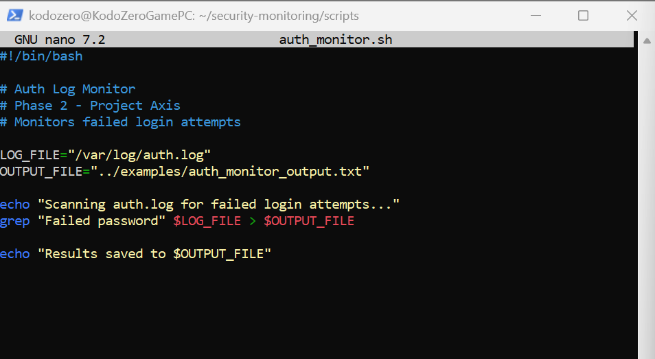  
- 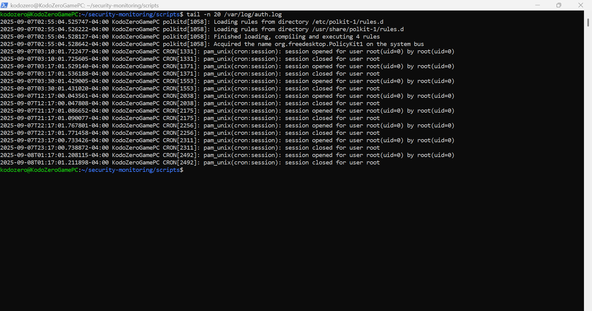  
- 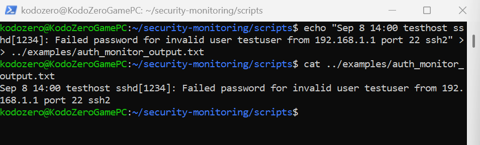

---

### 2. proc_watch.sh
**Purpose:** Monitors running processes and flags high CPU usage.  
**Learning Focus:** Process monitoring, filtering output, basic system alerts.  
**Examples:**  
- 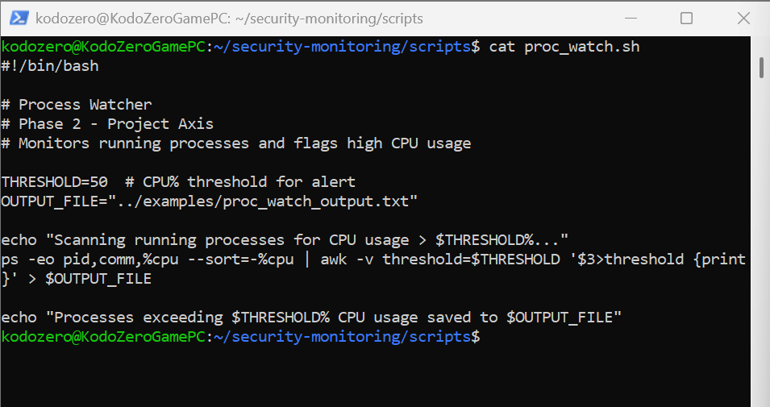  
- 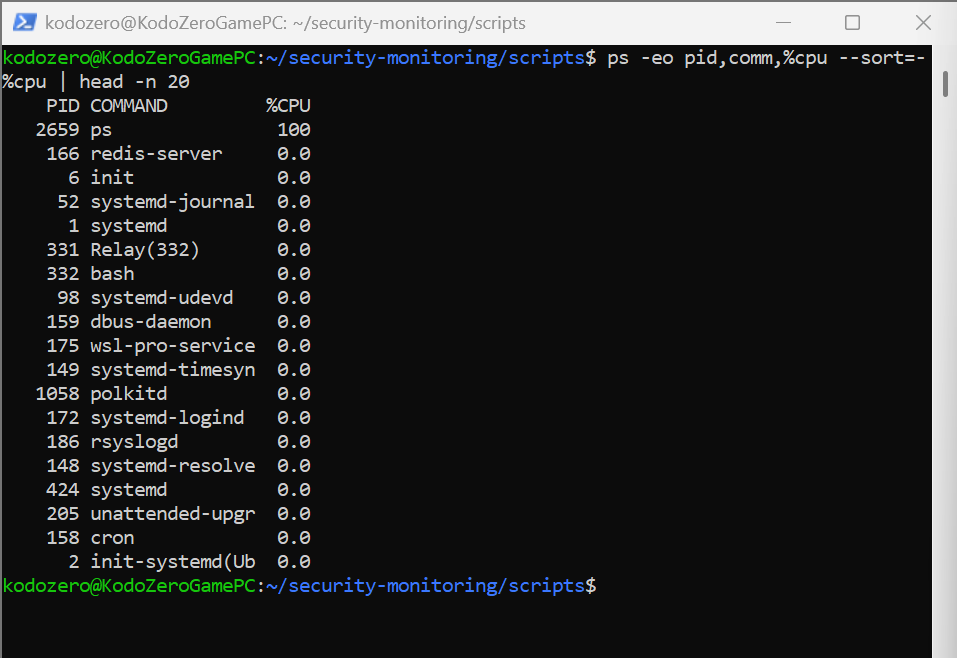  
- 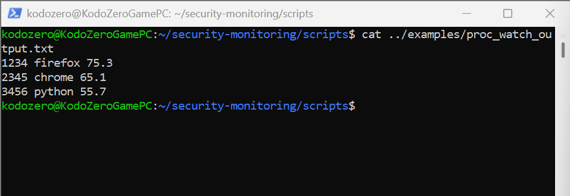

---

### 3. port_scan.sh
**Purpose:** Detects open TCP ports on localhost.  
**Learning Focus:** Port monitoring, basic network awareness, logging results, anonymization.  
**Examples:**  
- 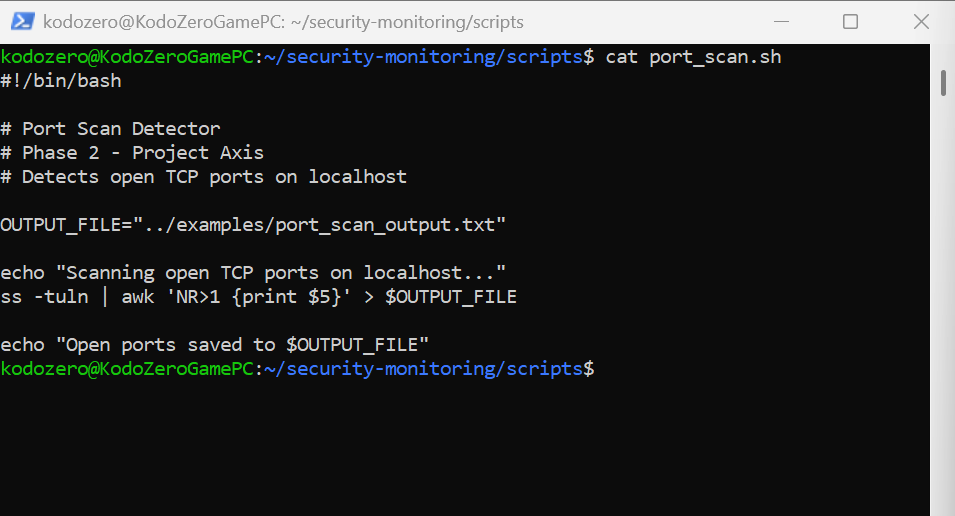  
- 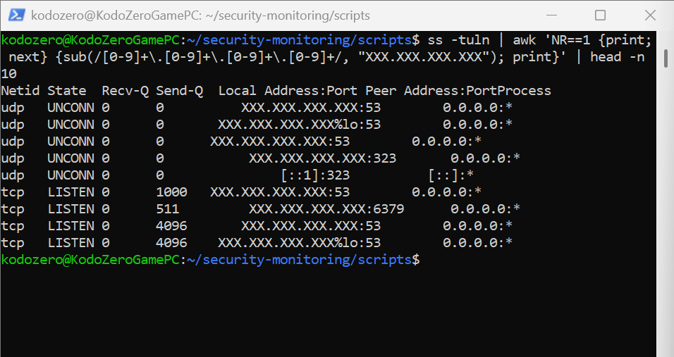  
- 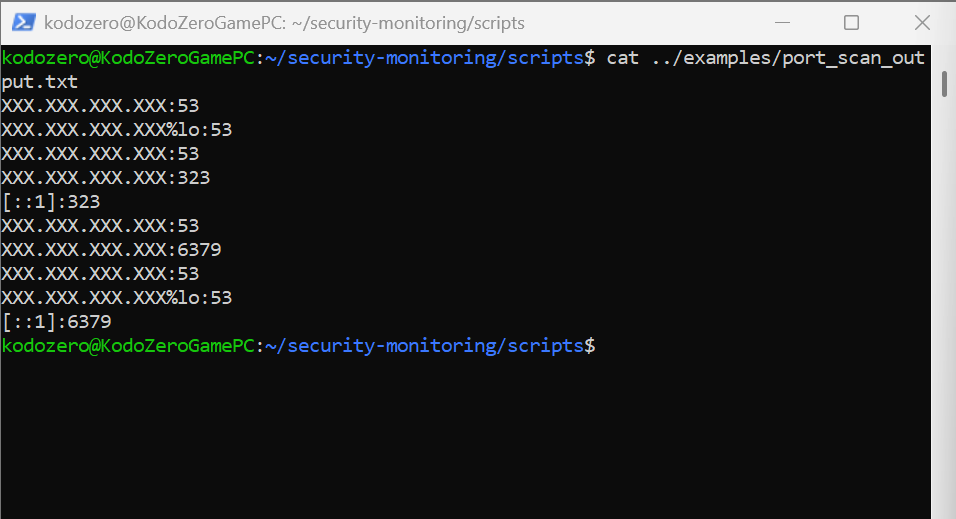

---

### 4. net_activity.sh
**Purpose:** Logs active network connections with timestamps.  
**Learning Focus:** Network monitoring, logging, anonymization, timestamping.  
**Examples:**  
- 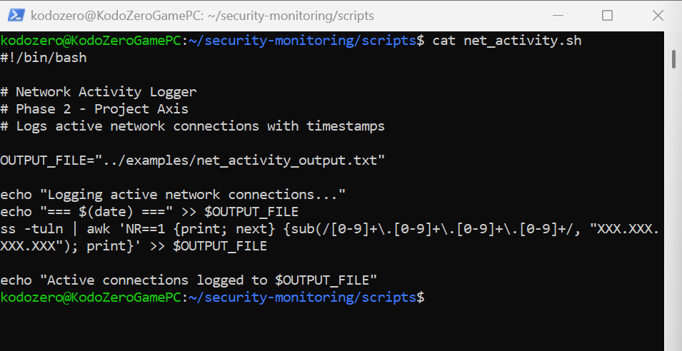  
-   
- 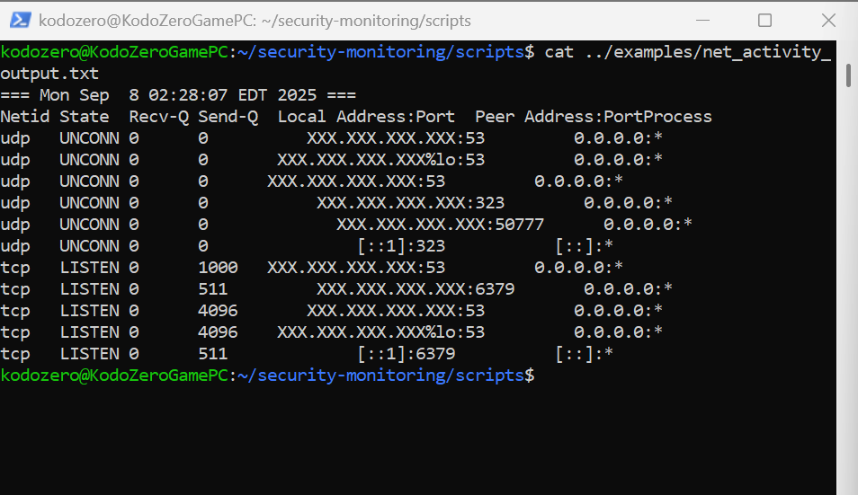

---

## 📌 Notes
- All outputs have been anonymized for safe public posting.  
- Phase 2 demonstrates security monitoring and system auditing skills.  
- Future phases of Project Axis will build on this foundation:  
  - Defensive Security Tools  
  - Intrusion Detection & Response  
  - Ethical Hacking Labs

---

## 👨‍💻 Author
**Clifton Saintfleur** — Cybersecurity Student

