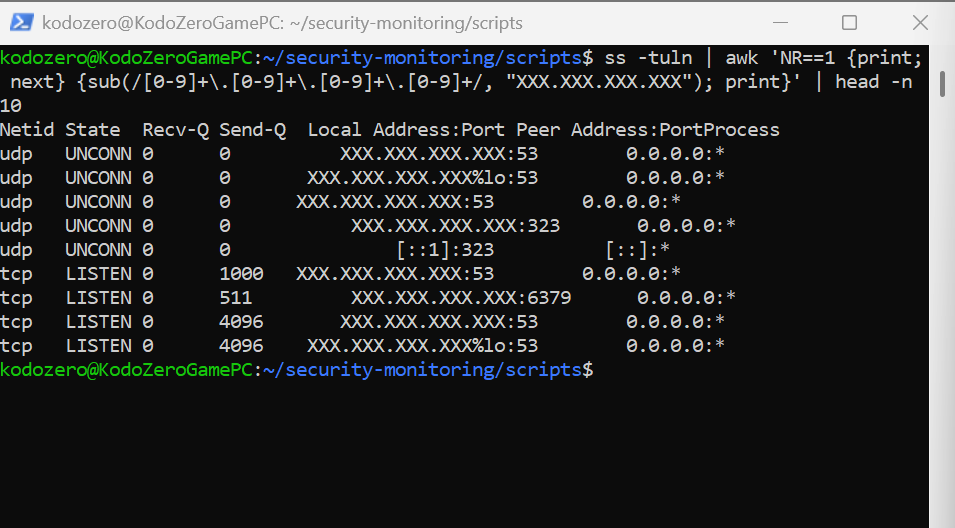

### 1. auth_monitor.sh
**Purpose:** Scans authentication logs for failed login attempts.  
**Learning Focus:** Log parsing, regular expressions, basic Linux monitoring.  

**Examples:**  

**Before running the script — Code:**  
  

**Before running the script — Log snapshot:**  
  

**After running the script — Output:**  

### 2. proc_watch.sh
**Purpose:** Monitors running processes and flags high CPU usage.  
**Learning Focus:** Process monitoring, filtering output, basic system alerts.  

**Examples:**  

**Code:**  
  

**Before running the script (system state):**  
  

**After running the script (output):**  

### 3. port_scan.sh
**Purpose:** Detects open TCP ports on localhost.  
**Learning Focus:** Port monitoring, basic network awareness, logging results.  

**Examples:**  

**Code:**  
  

**Before running the script:**  
  

**After running the script (example output):**  

### 4. net_activity.sh
**Purpose:** Logs active network connections with timestamps.  
**Learning Focus:** Network monitoring, logging, anonymization, timestamping.  

**Examples:**  
-   
-   
- 
